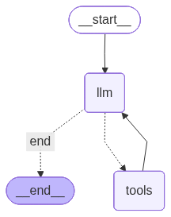

# Agentic Search Graph

A high-performance ReAct agent powered by Llama 3.3 70B on Groq for low-latency inference, with persistent web search via Tavily and state orchestration through LangGraph. It includes an optimized chat UI with source traceability.

## Graph Architecture



> Run `python visualize_graph.py` to regenerate the graph diagram.

## Why this project

- Robust ReAct loop: `llm -> tools -> llm` until final answer.
- Controlled tool calling for Groq (only `query` exposed to Tavily).
- Token-based history trimming to avoid TPM/request-size failures.
- Source-traceable answers in the chat UI.

## Requirements

- Python 3.9+
- A [Groq](https://console.groq.com) API key
- A [Tavily](https://app.tavily.com) API key

## Quickstart

### 1) Install

```bash
python -m venv .venv
source .venv/bin/activate   # Windows: .venv\Scripts\activate
pip install -r requirements.txt
```

### 2) Configure environment

```bash
cp .env.example .env
```

Edit `.env` with your keys:

```env
GROQ_API_KEY=your_groq_key
TAVILY_API_KEY=your_tavily_key
# MAX_HISTORY_TOKENS=8000
```

### 3) Run app

```bash
streamlit run app.py
```

### 4) Run tests

```bash
pip install -r requirements-dev.txt
pytest tests/
```

### 5) Optional: CLI mode

```bash
python -m src.langgraph_agent
```

### 6) Optional: export graph image

```bash
python visualize_graph.py
```

Generates `docs/graph.png` (or prints Mermaid syntax if rendering dependencies are missing).

## Architecture and deep dive

The full technical deep dive is in `docs/ARCHITECTURE.md`:

- graph nodes and edges
- `should_continue` routing logic
- tool policy and safeguards
- token-based context management
- source rendering flow in Streamlit

## Repository layout

| Path | Description |
|------|-------------|
| `src/langgraph_agent.py` | Agent state, graph nodes, router, compiled graph, CLI |
| `app.py` | Streamlit UI, agent invocation, answer and source rendering |
| `visualize_graph.py` | Exports the graph diagram to PNG or Mermaid fallback |
| `docs/ARCHITECTURE.md` | Technical architecture and design deep dive |
| `requirements.txt` | Dependencies |
| `langgraph.json` | LangGraph CLI/Studio configuration |
